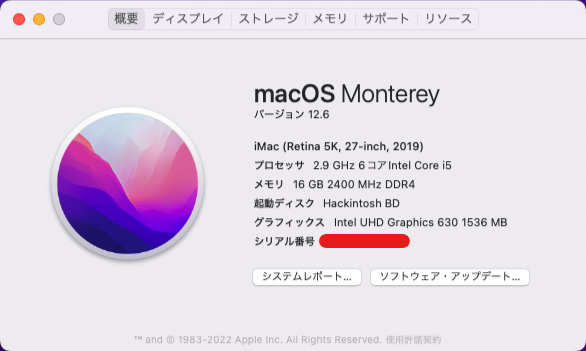

# Hackintosh for Deskmini 310

+ OS : macOS Monterey 12.5.1
+ Boot Loader : Open Core v0.8.4
+ UEFI Version : P4.40

## Configuration

| Specifications | Detail                           |
|----------------|----------------------------------|
| Barebone Kits  | Asrock Deskmini 310              |
| CPU            | Intel Core i5 9400               |
| RAM            | DDR4 2400MHz 8Gx2 (16GB)         |
| WLAN           | Intel Dual Band Wireless-AC 3168 |
| SSD            | WD BLUE 3D NAND SATA SSD 500GB   |

## UEFI

Load UEFI Defaults

+ Advanced
    + CPU Configuration
        + CPU C States Support: Disabled
    + Chipset Configuration
        + Onboard HD Audio: Enabled
        + Onboard HDMI HD Audio: Enabled
    + Super IO Configuration
        + Serial Port: Disabled
    + USB Configuration
        + XHCI Hand-off: Enabled
+ Security
    + Secure Boot: Disabled
    + Intel Platform Trust Technology: Enabled
+ BOOT
    + CSM: Disabled

## Notes *Japanese

HackintoshでDeskmini 310にmacOS Montereyをインストールします。
macOSのインストーラーについては各自で入手してください。
Windows 11と一緒に使う場合はSecure Bootを使い分けてください。

Translation by Google Translate

Install MacOS Monterey on Deskmini 310 with Hackintosh.
Please obtain your own for the MacOS installer.
Please switch Secure Boot if used with Windows 11.

