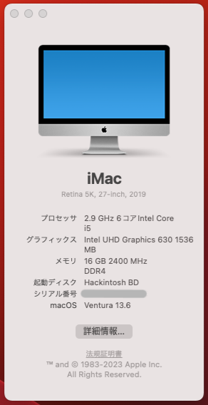

# Hackintosh for Deskmini 310

+ OS : macOS Ventura 13.2.1
+ Boot Loader : Open Core v0.9.2
+ UEFI Version : P4.40

## Configuration

| Specifications | Detail                           |
|----------------|----------------------------------|
| Barebone Kits  | Asrock Deskmini 310              |
| CPU            | Intel Core i5 9400               |
| RAM            | DDR4 2400MHz 8Gx2 (16GB)         |
| WLAN           | Intel Dual Band Wireless-AC 3168 |
| SSD (Mac)      | WD BLUE 3D NAND SATA SSD 500GB   |
| SSD2 (Windows) | WD BLUE 3D NAND NVMe SSD 500GB   |

## UEFI

Load UEFI Defaults

+ Advanced
    + CPU Configuration
        + CPU C States Support: Disabled
    + Super IO Configuration
        + Serial Port: Disabled
    + USB Configuration
        + XHCI Hand-off: Enabled
+ Security
    + Secure Boot: Disabled
+ BOOT
    + CSM: Disabled

## Notes *Japanese

HackintoshでDeskmini 310にmacOS Venturaをインストールします。
macOSのインストーラーについては各自で入手してください。

Translation by Google Translate

Install MacOS Ventura on Deskmini 310 with Hackintosh.
Please obtain your own for the MacOS installer.

